  <!-- Senior Animated Hero Banner -->
  

    

  <!-- Action Badges -->
  

    
    &nbsp;
    
    &nbsp;
    
    &nbsp;
    
  

---

### ⚡ Executive Profile & Engineering Background

> **Senior-level Full-Stack Developer & MERN Specialist** with **3+ years of battle-tested professional experience** designing, engineering, and scaling resilient web applications. Proven track record of translating complex architectural and business requirements into intuitive, high-performance digital products.

Expert in the complete JavaScript & TypeScript ecosystem across frontend and backend tiers:
- 🚀 **Full-Lifecycle Ownership:** Architecting high-throughput REST APIs, responsive interfaces, and scalable database schemas from day zero to production.
- ⚡ **High-Performance Architecture:** Optimizing DOM rendering pipelines, state management, database query indexing, and caching to ensure sub-second latency and top Lighthouse performance.
- 🔒 **Defensive Security & Auth:** Hardening applications with JWT/OAuth authentication, role-based access control (RBAC), data sanitization, and defensive API validation.
- 🛠️ **Troubleshooting & Optimization:** Veteran at diagnosing critical bottlenecks, root-cause debugging, cross-browser compatibility, and memory leak resolution.

---

### 🛠️ Technical Competencies & Tech Stack

  

 

| Domain | Core Technologies & Advanced Capabilities |
| :--- | :--- |
| **🎨 Frontend Engineering** | **React.js, TypeScript, JavaScript (ES6+), HTML5, CSS3, Bootstrap** &bull; Custom Hooks & Context API Architecture &bull; Responsive & Adaptive Web Design (Mobile-First) &bull; High-Performance DOM Manipulation & State Optimization &bull; Cross-Browser & Multi-Device Compatibility |
| **⚙️ Backend & API Systems** | **Node.js, Express.js, PHP, RESTful Architecture** &bull; Scalable REST API Design, Custom Middlewares & Routing &bull; Enterprise Authentication (JWT, OAuth, Session Management) &bull; Defensive Payload Validation, Sanitization & Error Handling &bull; Asynchronous Task Pipelines & Response Optimization |
| **🗄️ Database & Storage Layer** | **MongoDB (Mongoose ODM), Relational MySQL** &bull; Advanced Schema Modeling & Relational Normalization &bull; High-Speed Indexing Strategies & Query Tuning &bull; Aggregation Pipelines & Data Consistency Management |
| **🔧 Tooling & Engineering Practices** | **Git, GitHub, VS Code, Chrome DevTools, Postman** &bull; Production Debugging, Profiling & Memory Leak Diagnostics &bull; Performance Optimization (Code Splitting, Lazy Loading, Asset Compression) &bull; Clean Architecture, DRY & SOLID Principles, Agile Delivery |

---

### 💎 Engineering Standards & Key Strengths

- 🎯 **End-to-End Architectural Precision:** Seamlessly binding dynamic React clients to robust Node/Express micro-services and scalable data stores.
- ⚡ **Obsessed with Speed & Performance:** Relentless focus on rapid page loads, minimal bundle overhead, and efficient database lookups.
- 🛡️ **Reliable & Resilient:** Writing clean, testable, maintainable code engineered to withstand high traffic and heavy workloads.
- 🤝 **Collaborative Problem Solver:** Thriving in fast-paced environments, leading technical initiatives, and delivering production milestones on schedule.

---

### 📊 Real-Time GitHub Intelligence

  <table border="0" style="border: none;">
    <tr>
      <td>
        
      </td>
      <td>
        
      </td>
    </tr>
  </table>

  

    
  

---

### 📬 Let's Build High-Impact Systems

Whether you are seeking a **Senior Full-Stack Developer**, need a custom web application architected from the ground up, or want to collaborate on cutting-edge products:

  
  &nbsp;&nbsp;
  
  &nbsp;&nbsp;
  

  ⚡ Engineered with precision by <strong>Usama Hassan</strong> &bull; Senior MERN Stack Developer

