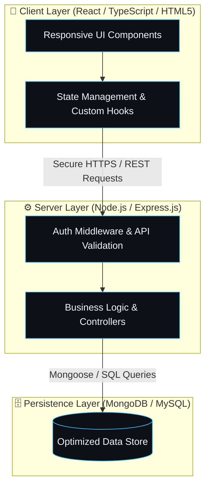

<div align="center">

  <!-- Neon Glowing Typing Banner -->
  <a href="https://github.com/UsamaHassan-IT">
    
  </a>

  <p align="center">
    <samp>
      <strong>[ 3+ Years Experience ]</strong> &bull;
      <strong>[ Production-Grade MERN Stack ]</strong> &bull;
      <strong>[ REST & Microservices ]</strong>
    </samp>
  </p>

  <!-- Cyber Pill CTA Badges -->
  <p align="center">
    <a href="https://flovoa.portfolio.com" target="_blank">
      
    </a>
    &nbsp;
    <a href="https://www.linkedin.com/in/usamahassan-it" target="_blank">
      
    </a>
    &nbsp;
    <a href="mailto:usamahassan.it@gmail.com">
      
    </a>
    &nbsp;
    <a href="https://github.com/UsamaHassan-IT">
      
    </a>
  </p>

  

</div>

<br />

### 🧑‍💻 `whoami` &mdash; Executive Developer Profile

```typescript
const developer: SoftwareEngineer = {
  name: "Usama Hassan",
  title: "MERN Stack Developer & Full-Stack Architect",
  experience: "3+ Years of Production-Ready Web Engineering",
  status: "Available for High-Impact Roles & Custom Builds",
  location: "Global / Remote",
  stack: {
    frontend: ["React.js", "TypeScript", "JavaScript (ES6+)", "HTML5", "CSS3", "Bootstrap"],
    backend:  ["Node.js", "Express.js", "PHP", "REST APIs", "JWT Auth", "OAuth2"],
    database: ["MongoDB", "Mongoose ODM", "MySQL"],
    devops:   ["Git", "GitHub", "Chrome DevTools", "VS Code", "Postman", "CI/CD"]
  },
  missionStatement: () => {
    return "Transforming complex business logic into blazing-fast, secure, and intuitive web systems.";
  }
};
```

---

### 🍱 Tech Ecosystem & Competencies

<div align="center">
  
</div>

<br />

<table>
  <thead>
    <tr style="border: none;">
      <th width="50%" align="left">🎨 Frontend & UI Architecture</th>
      <th width="50%" align="left">⚙️ Backend & API Engineering</th>
    </tr>
  </thead>
  <tbody>
    <tr>
      <td>
        <ul>
          <li><strong>React Ecosystem:</strong> Hooks, Context API, Modular Component Design</li>
          <li><strong>Languages:</strong> JavaScript (ES6+), TypeScript, Modern HTML5, CSS3</li>
          <li><strong>Styling & UX:</strong> Bootstrap, Responsive Web Design, DOM Manipulation</li>
          <li><strong>Quality:</strong> Cross-Browser Consistency, Accessibility & Speed</li>
        </ul>
      </td>
      <td>
        <ul>
          <li><strong>Runtime & Frameworks:</strong> Node.js, Express.js, PHP</li>
          <li><strong>API Architecture:</strong> RESTful APIs, Custom Middlewares, Endpoint Validation</li>
          <li><strong>Security:</strong> Authentication (JWT/OAuth), Authorization, Sanitization</li>
          <li><strong>Performance:</strong> Async Pipelines, Caching & Optimized Latency</li>
        </ul>
      </td>
    </tr>
    <tr>
      <th align="left">🗄️ Database & Data Layer</th>
      <th align="left">🛠️ Engineering Toolchain & Practices</th>
    </tr>
    <tr>
      <td>
        <ul>
          <li><strong>NoSQL:</strong> MongoDB with Mongoose ODM modeling</li>
          <li><strong>Relational SQL:</strong> MySQL schema design & query tuning</li>
          <li><strong>Data Ops:</strong> Indexing, Aggregation Pipelines, Transactions</li>
        </ul>
      </td>
      <td>
        <ul>
          <li><strong>Version Control:</strong> Git, GitHub Flow, Code Reviews</li>
          <li><strong>Diagnostics:</strong> Chrome DevTools, Postman, Debugging suites</li>
          <li><strong>Methods:</strong> Performance Profiling, Clean Code, Agile Delivery</li>
        </ul>
      </td>
    </tr>
  </tbody>
</table>

---

### ⚡ Architectural Workflow



---

### 📊 Real-Time GitHub Analytics

<div align="center">
  <table border="0" style="border: none;">
    <tr>
      <td>
        
      </td>
      <td>
        
      </td>
    </tr>
  </table>

  <p align="center">
    
  </p>

  <!-- GitHub Trophy Showcase -->
  <p align="center">
    
  </p>
</div>

---

### 🚀 Let's Build Something Exceptional

<p align="center">
  Looking for a dedicated <strong>MERN Stack Developer</strong> to build your next web app or scale your team?
</p>

<p align="center">
  <a href="https://flovoa.portfolio.com" target="_blank">
    
  </a>
  &nbsp;&nbsp;
  <a href="mailto:usamahassan.it@gmail.com">
    
  </a>
  &nbsp;&nbsp;
  <a href="https://www.linkedin.com/in/usamahassan-it" target="_blank">
    
  </a>
</p>

<div align="center">
  <sub>⚡ Designed for high impact &bull; <strong>Usama Hassan</strong> &bull; © 2026</sub>
</div>
