  <!-- Animated Native Hero Banner -->
  

    

  <!-- Action CTA Badges -->
  

    
    &nbsp;
    
    &nbsp;
    
    &nbsp;
    
  

---

### 👨‍💻 Executive Developer Profile

> **MERN Stack Developer** with **3+ years of professional web development experience** building high-performance, responsive full-stack applications. Proven expertise across **JavaScript, TypeScript, React.js, Node.js, Express.js, MongoDB, and MySQL**, with deep hands-on experience in RESTful API development, database optimization, authentication, debugging, and end-to-end performance tuning.

- 🚀 **Full-Lifecycle Web Engineering:** Translating complex business requirements into robust, production-ready full-stack applications.
- 🎨 **Responsive Frontend Architecture:** Building intuitive, pixel-perfect user interfaces with React.js, TypeScript, HTML5, CSS3, and Bootstrap.
- ⚙️ **Secure Backend & API Systems:** Architecting scalable REST APIs with Node.js/Express, JWT/OAuth authentication, and defensive request validation.
- 🗄️ **Database Optimization:** Designing normalized relational schemas (MySQL) and high-throughput NoSQL document models (MongoDB/Mongoose).
- 🌐 **Live Portfolio:** [portfolio.flovoa.com](https://portfolio.flovoa.com)

---

### 🛠️ Technology Stack

  

 

<!-- Animated Proficiency & Engineering Matrix -->

  

---

### 📈 Live Commit & Contribution Activity

  

---

### 💎 Engineering Standards & Core Pillars

<table>
  <tr>
    <td width="33%" align="center" valign="top">
      <h3>⚡ Performance First</h3>
      

        Optimizing DOM rendering, state pipelines, database indexing, and asset delivery to ensure sub-second response times and high Core Web Vitals scores.
      

    </td>
    <td width="33%" align="center" valign="top">
      <h3>🛡️ Security &amp; Auth</h3>
      

        Implementing enterprise-grade authentication (JWT/OAuth), role-based access control (RBAC), input sanitization, and defensive API error handling.
      

    </td>
    <td width="33%" align="center" valign="top">
      <h3>📱 Responsive UX</h3>
      

        Delivering seamless, mobile-first, cross-browser compatible user interfaces with intuitive interactions and clean component architecture.
      

    </td>
  </tr>
</table>

---

### 📬 Let's Build Something Exceptional

Looking for a **MERN Stack Developer** to join your team, build a scalable web application, or collaborate on exciting projects?

  
  &nbsp;&nbsp;
  
  &nbsp;&nbsp;
  

  ⚡ Engineered with precision by <strong>Usama Hassan</strong> &bull; Senior MERN Stack Developer &bull; © 2026

