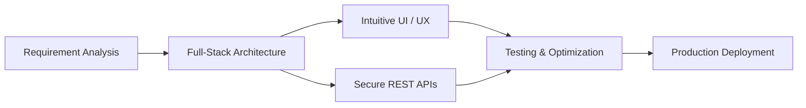

  <!-- Header Typing Animation -->
  

  

    <strong>Full-Stack Engineer &bull; MERN Specialist &bull; Clean Code Advocate</strong>
  

  <!-- Quick Badges / Socials -->
  

    
    
    
    
  

  

---

### 👨‍💻 Professional Profile

> **MERN Stack Developer** with **3+ years of professional web development experience** building scalable, responsive full-stack applications. Skilled in translating complex business requirements into high-performance web solutions, crafting intuitive user interfaces, architecting RESTful APIs, and implementing robust database schemas. Passionate about writing clean, maintainable code and optimizing web performance.

- 🔭 **Currently Focusing On**: Scalable Cloud Architectures, Advanced React Patterns & Microservices.
- ⚡ **Core Philosophy**: Performance, Security, and Seamless User Experiences.
- 💬 **Ask Me About**: React.js, Node.js, Express.js, MongoDB, RESTful APIs, and Frontend Architecture.
- 📫 **Let's Connect**: Open to exciting frontend, backend, or full-stack opportunities.

---

### 🛠️ Technical Arsenal

  <!-- Skill Icons Grid -->
  

 

<table>
  <tr>
    <td width="50%" valign="top">
      <h4>🎨 Frontend Development</h4>
      <ul>
        <li><strong>Languages:</strong> JavaScript (ES6+), TypeScript, HTML5, CSS3</li>
        <li><strong>Frameworks & Libraries:</strong> React.js, Bootstrap</li>
        <li><strong>Core Competencies:</strong> Responsive Web Design, DOM Manipulation, State Management, UI/UX Component Architecture</li>
      </ul>
    </td>
    <td width="50%" valign="top">
      <h4>⚙️ Backend & API Engineering</h4>
      <ul>
        <li><strong>Environments & Frameworks:</strong> Node.js, Express.js, PHP</li>
        <li><strong>Architecture:</strong> RESTful API Design & Integration</li>
        <li><strong>Security & Middleware:</strong> Authentication (JWT/OAuth), Authorization, API Validation, Error Handling</li>
      </ul>
    </td>
  </tr>
  <tr>
    <td width="50%" valign="top">
      <h4>🗄️ Databases & Storage</h4>
      <ul>
        <li><strong>NoSQL:</strong> MongoDB, Mongoose ODM</li>
        <li><strong>Relational SQL:</strong> MySQL</li>
        <li><strong>Capabilities:</strong> Data Modeling, Query Optimization, CRUD Operations, Indexing</li>
      </ul>
    </td>
    <td width="50%" valign="top">
      <h4>🛠️ Tools & Engineering Practices</h4>
      <ul>
        <li><strong>Version Control:</strong> Git, GitHub</li>
        <li><strong>Developer Tools:</strong> VS Code, Chrome DevTools, Postman</li>
        <li><strong>Practices:</strong> Debugging, Cross-Browser Compatibility, Performance Optimization, Unit & Integration Testing</li>
      </ul>
    </td>
  </tr>
</table>

---

### 🚀 What I Bring to the Table

- 💡 **End-to-End Delivery**: Seamlessly connecting dynamic React interfaces with robust Node/Express backends.
- ⚡ **Optimized Performance**: Applying lazy loading, query optimizations, and caching to ensure rapid page speeds.
- 🔒 **Secure & Scalable**: Adhering to secure auth patterns, input sanitization, and structured API error handling.
- 🤝 **Collaborative Problem Solver**: Proven track record of debugging tricky production bugs and delivering quality code on schedule.

---

### 📊 GitHub Activity & Insights

  <table border="0">
    <tr>
      <td>
        
      </td>
      <td>
        
      </td>
    </tr>
  </table>

  

    
  

---

### 📬 Get in Touch

  Whether you have an interesting project idea, a full-time role, or just want to talk tech — my inbox is always open!

  
  &nbsp;&nbsp;
  
  &nbsp;&nbsp;
  

  Built with ❤️ by <a href="https://github.com/usamahassan-IT">Usama Hassan</a> &bull; © 2026

