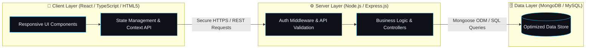

<div align="center">

  <!-- Native Animated Terminal Banner -->
  <a href="https://flovoa.portfolio.com" target="_blank">
    
  </a>

  <br /><br />

  <!-- Direct Action Links -->
  <p align="center">
    <a href="https://flovoa.portfolio.com" target="_blank">
      
    </a>
    &nbsp;
    <a href="https://www.linkedin.com/in/usamahassan-it" target="_blank">
      
    </a>
    &nbsp;
    <a href="mailto:usamahassan.it@gmail.com">
      
    </a>
    &nbsp;
    <a href="https://github.com/usamahassan-IT">
      
    </a>
  </p>

</div>

---

### 🧑‍💻 `whoami` &mdash; Developer Persona

```typescript
const usamaHassan: SoftwareEngineer = {
  role: "MERN Stack Developer & Full-Stack Architect",
  experience: "3+ Years of Building Production Web Systems",
  portfolio: "https://flovoa.portfolio.com",
  contact: "usamahassan.it@gmail.com",
  status: "Open to Full-Time Roles & High-Impact Contracts",
  coreCompetencies: {
    frontend: ["React.js", "TypeScript", "JavaScript (ES6+)", "HTML5", "CSS3", "Bootstrap"],
    backend:  ["Node.js", "Express.js", "PHP", "RESTful APIs", "JWT / OAuth2 Security"],
    database: ["MongoDB", "Mongoose ODM", "MySQL"],
    tooling:  ["Git", "GitHub", "Chrome DevTools", "VS Code", "Postman", "Performance Profiling"]
  },
  engineeringPhilosophy: () => {
    return "Writing clean, scalable code that translates complex business requirements into fast, intuitive applications.";
  }
};
```

---

### 🍱 Technical Arsenal & Core Stack

<div align="center">
  
</div>

<br />

<table>
  <thead>
    <tr>
      <th width="50%" align="left">🎨 Frontend & UI Engineering</th>
      <th width="50%" align="left">⚙️ Backend & API Scalability</th>
    </tr>
  </thead>
  <tbody>
    <tr>
      <td>
        <ul>
          <li><strong>React Ecosystem:</strong> Hooks, State Management, Modular Component Architecture</li>
          <li><strong>Languages:</strong> Modern JavaScript (ES6+), TypeScript, Semantic HTML5, CSS3</li>
          <li><strong>UI & Styling:</strong> Bootstrap, Responsive Web Design, DOM Optimization</li>
          <li><strong>Cross-Browser:</strong> Ensuring pixel-perfect compatibility & high Lighthouse scores</li>
        </ul>
      </td>
      <td>
        <ul>
          <li><strong>Runtime & Frameworks:</strong> Node.js, Express.js, PHP</li>
          <li><strong>API Design:</strong> RESTful Endpoints, Custom Middlewares, Payload Validation</li>
          <li><strong>Security:</strong> Authentication (JWT/OAuth), Role-Based Access Control, Sanitization</li>
          <li><strong>Performance:</strong> Async pipelines, rate limiting, and reduced response latency</li>
        </ul>
      </td>
    </tr>
    <tr>
      <th align="left">🗄️ Database & Data Modeling</th>
      <th align="left">🛠️ Engineering Toolchain & Practices</th>
    </tr>
    <tr>
      <td>
        <ul>
          <li><strong>NoSQL:</strong> MongoDB with Mongoose ODM schemas & validation</li>
          <li><strong>Relational SQL:</strong> MySQL relational design, indexing & normalization</li>
          <li><strong>Data Operations:</strong> Aggregation pipelines, CRUD operations, query optimization</li>
        </ul>
      </td>
      <td>
        <ul>
          <li><strong>Version Control:</strong> Git, GitHub Workflow, Feature Branching</li>
          <li><strong>Diagnostics:</strong> Chrome DevTools, Postman API testing, Debugging suites</li>
          <li><strong>Standards:</strong> Agile delivery, clean architecture, performance tuning</li>
        </ul>
      </td>
    </tr>
  </tbody>
</table>

---

### ⚡ Full-Stack Architectural Pipeline



---

### 📊 GitHub Activity & Analytics

<div align="center">
  <table border="0" style="border: none;">
    <tr>
      <td>
        
      </td>
      <td>
        
      </td>
    </tr>
  </table>

  <p align="center">
    
  </p>
</div>

---

### 🚀 Let's Build Something Great Together

<p align="center">
  Have an exciting project, open role, or contract? Let's connect!
</p>

<p align="center">
  <a href="https://flovoa.portfolio.com" target="_blank">
    
  </a>
  &nbsp;&nbsp;
  <a href="mailto:usamahassan.it@gmail.com">
    
  </a>
  &nbsp;&nbsp;
  <a href="https://www.linkedin.com/in/usamahassan-it" target="_blank">
    
  </a>
</p>

<div align="center">
  <sub>⚡ Designed for high impact &bull; <strong>Usama Hassan</strong> &bull; © 2026</sub>
</div>
